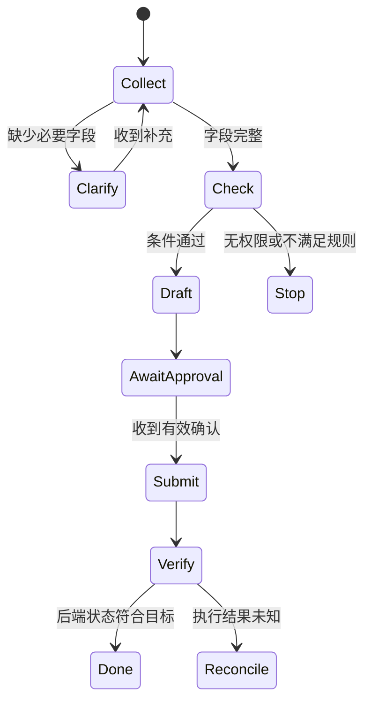

# 07｜规划与工作流：让执行可以暂停、恢复和结束

[上一章](06-memory-and-context.md) · [首页](../../README.md) · [下一章](08-multi-agent.md)

**本章目标：**把自然语言计划变成状态转换，能说明重新规划、持久化与人工确认的边界。

## 计划只是一组待验证假设

“查库存 → 查规则 → 创建预约”看起来合理，但可能一开始连设备型号都不确定。计划必须允许根据观察调整；已经发生的事实与尚未执行的步骤也必须分开。

对于设备申请，可以采用确定性的外层流程：



在 `Check` 内部，可以让模型选择搜索词或需要查询的规则；但“是否有确认”“是否允许提交”由程序判断。模型擅长处理开放的选择空间，状态机负责维护系统不变量。

## 常见编排方式怎么选

| 方式 | 适用条件 | 需要注意 |
| --- | --- | --- |
| 串行链 | 步骤明确且后一项依赖前一项 | 前面的错误向后传递 |
| 路由 | 输入存在清楚类别 | 未知类别需要兜底 |
| 并行 | 子任务互不依赖 | 汇总、限流与部分失败 |
| 计划后执行 | 任务可先形成粗略分解 | 计划可能随环境过期 |
| 执行后重规划 | 新观察显著影响路径 | 循环和重复动作 |
| 生成后检查 | 有独立、可靠的验收标准 | 检查器可能同样犯错 |

这些架构模式可与 [Building Effective Agents](https://www.anthropic.com/engineering/building-effective-agents)对照阅读。选择时先问：新增一次调用解决哪个已观察到的失败？如果没有明确答案，先保留简单基线。

## 重新规划需要触发条件

有意义的触发包括：工具发现前提不成立；关键证据缺失；用户修改需求；原资源不可用。单纯“感觉还不够好”不应触发无限修订。

可以把每一步的计划写成包含依赖和验收的记录：

```json
{
  "step_id": "check-stock",
  "depends_on": ["resolve-device"],
  "input": {"device_id": "dev-17"},
  "done_when": "返回带时间戳的库存结果",
  "status": "pending",
  "attempts": 0
}
```

动作前校验前置条件，动作后记录证据；失败时判断是重试同一步、换路径还是终止。计划不是自由文本越长越好，而是应该足以回答“现在卡在哪里、怎样知道能继续”。

[Tree of Thoughts](https://arxiv.org/abs/2305.10601)探索多条候选路径与搜索；其研究任务上的结果不代表所有生产任务都值得付出搜索成本。分支因子为 $b$、深度为 $d$ 时，完整树可能包含 $1+b+\cdots+b^d$ 个节点，预算很快膨胀，必须设置剪枝和搜索上限。

## 持久化与恢复不是重新跑一遍

运行记录应保存任务 ID、当前状态、已完成步骤、工具操作 ID、剩余预算和必要的版本信息。恢复时先读取真实业务状态，不能因为本地最后一条日志没有“成功”，就重新提交外部写操作。

检查点要放在有意义的状态边界。对于长任务，最好能分别回答“系统决定了什么”“动作是否发出”“外部结果是否确认”。三者不能压成一个 `done=true`。

取消也应是协议：停止新动作，向仍可取消的工具传递取消信号，记录已发生的副作用，并告诉调用方最终状态。关闭页面不代表远端任务停止；超时也不等于回滚。

## 人工确认应批准具体动作

需要确认的节点应展示具体对象、数量、目标位置、变更摘要和有效期。确认应绑定这些参数及版本；确认后若参数变化或库存已过期，需要重新校验，必要时再次确认。

低风险的只读查询不必每次打断用户。把确认集中在会产生外部承诺或难以撤销的边界，才能让确认有实际信息价值。审批只是产品策略的一部分，不能替代服务端权限检查。

## 动手练习与答案

一个任务已经生成草稿并收到确认。执行器崩溃重启后，本地状态停在 `Submit`，远端实际可能已创建记录。设计恢复流程。

**参考答案：**使用持久化的操作 ID 或幂等键查询远端；已成功则读取记录并验证；仍在执行则继续观察；确认未执行才按原契约重试；未知状态进入对账，不能生成新键直接重做。若原确认绑定的参数改变，不能复用旧确认。

**自评标准（4 分）：**区分未知与失败 1 分；恢复使用原操作标识 1 分；有最终状态验证 1 分；考虑确认与参数绑定 1 分。

## 面试追问

**“工作流框架替你解决了什么？”** 通常是状态管理、节点调度、检查点或可视化。业务验收、工具幂等、权限和跨系统恢复仍需自己定义。讲框架名称之前，先把这些接口解释清楚。

[学习路线](../roadmap.md) · [资料索引](../resources.md)
