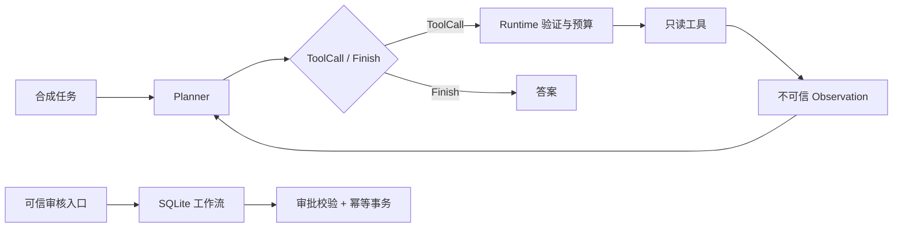

# 代码导读：从一次工具调用到可恢复的工作流

这套实验把控制权分成三层：Planner 提议，Runtime 检查，业务工作流决定能否产生写入。默认演示不调用模型；可选真实模型只替换 Planner。这样可以先把执行边界测清楚，再研究模型是否能选对工具。

## 先跑通三个基础实验

需要 Python 3.11 或更高版本。运行依赖全部来自标准库；安装构建使用 setuptools。第一次安装可能需要访问包索引下载构建工具，演示与测试本身不联网。

在仓库根目录执行：

```bash
python3 -m venv .venv
source .venv/bin/activate
python -m pip install -e .
python -m agentlab demo tools
python -m agentlab demo rag
python -m agentlab demo workflow
python -m agentlab evaluate --output work/evaluation.json
python -m unittest discover -s tests -v
```

Windows PowerShell 激活命令为 `.venv\Scripts\Activate.ps1`。如果只想在本地已有 Python 上离线运行，POSIX shell 可使用 `PYTHONPATH=src python3 -m agentlab demo tools`；这不需要安装构建工具。

| 命令 | 应当观察到什么 | 不代表什么 |
| --- | --- | --- |
| `demo tools` | `mode=scripted_test_double`，两次只读工具执行，第三步结束 | 没有测模型选工具或推理的能力 |
| `demo rag` | 退款政策有文档 ID 引用；虚构月球保险问题拒答 | 没有 embedding 或生成式回答 |
| `demo workflow` | 未批尝试被拒绝；重新连接后恢复审批状态；重试只产生一条工单 | 没有真实客服平台、用户认证或退款 |
| `evaluate` | 两组阈值、每题结果、明确分子/分母、数据摘要哈希 | 不是大规模 benchmark 或线上质量分数 |

`workflow` 演示使用临时数据库，结束后清理；“恢复”通过同一次演示中关闭、重新打开连接展示。要跨进程练习，可在自己的脚本中给 `TicketWorkflow` 一个 `work/` 下的固定路径，并通过可信调用方保存审批令牌。

## 目录和阅读顺序

| 顺序 | 文件 | 阅读重点 |
| --- | --- | --- |
| 1 | [runtime.py](../src/agentlab/runtime.py) | `Planner` Protocol、`ToolCall` / `Finish`、参数校验、步骤上限 |
| 2 | [test_runtime.py](../tests/test_runtime.py) | 未知工具、写入工具、越权字段、无限循环、重试边界 |
| 3 | [retrieval.py](../src/agentlab/retrieval.py) | 先租户过滤，再打分，再阈值判断，最后引用或拒答 |
| 4 | [evaluation.py](../src/agentlab/evaluation.py) | 可答率、拒答率、引用标签命中与分母 |
| 5 | [workflow.py](../src/agentlab/workflow.py) | 持久化状态、审批绑定、事务与幂等 |
| 6 | [test_workflow.py](../tests/test_workflow.py) | 重启、审批失效、故障回滚、并发重放 |
| 7 | [live.py](../src/agentlab/live.py) | 可选真实模型接口，失败时停止，模型输出仍需检查 |



## 工具循环：模型建议不等于执行权限

`ScriptedPlanner` 返回预先编写的动作，是 **test double**。它能让失败路径稳定复现，但不会根据结果推理。`Finish` 中的答案也是预先写好的，不能用演示成功来证明答案可靠。

`Runtime.run` 每轮只接受一个动作。工具必须已经注册，且 `read_only=True`；即使注册了写入工具，这个实验 Runtime 也会拒绝执行。数字参数必须是真正的整数或浮点数，不接受 Python 中可当作整数的布尔值、不接受字符串、NaN、无穷大或越界数。额外的 `approved` 字段同样无效。

循环默认最多 6 个 planner 步骤，结束动作也占一步。工具只有显式声明 `retry_safe=True`，且抛出 `TimeoutError` 时，才最多再尝试 1 次。模型请求不重试；普通业务异常也不重试。这个上限约束调用次数，不会强制终止任意卡死的 Python 函数。真实系统仍需要进程隔离、取消机制和端到端 deadline。

工具 CLI 使用 `quality.py` 单独检查固定任务，输出 `task_success` 和逐项 `evaluation`；普通 Runtime 没有传入评分器时结果为 null。`completed` 只代表循环结束。最终 JSON 字段需要和实际工具观察一致，不能用一段成功文案替代。

Trace 只保存步骤编号、受控工具名、次数、任务评分状态和错误码，不记录任务文本、参数、返回正文或 provider 异常。模型的最终答案会出现在 CLI 输出中；如果扩展成接收真实输入，仍需另行设计输出与数据保留策略。

运行故障练习：

```bash
python examples/failure_drills.py
```

预期包含 `unknown_tool`、`invalid_arguments`、`approval_required_or_stale`，且 `tickets_created` 为 `0`。这些错误意味着边界生效，不是任务完成。

## 检索：把“有引用”拆成可检查的步骤

查询和文档转成小写英文字母数字词项集合，再去除固定停用词。打分为：

$$
s(q,d)=\frac{|T(q)\cap T(d)|}{|T(q)|}
$$

其中 `T(d)` 同时包含标题和正文。重复出现的词不会额外加分。这只是查询词覆盖率，不是相关概率，也不是 BM25。查询为空或交集为空时直接无结果。

`tenant` 来自可信应用上下文，在排名前过滤。返回最高分文档全文并附文档 ID；分数低于 `0.6` 时拒答。这里没有生成器，因此可以检查原文出处，但文档相关性仍可能错，资料本身也可能错或含恶意指令。引用不赋予资料任何执行权限。

当前语料刻意使用英文，便于看清算法。中文分词、同义表达、拼写错误、多跳问题、时效性和句子级引用都不在当前能力范围内。

## 评测：同一数据上的取舍

运行 `evaluate` 只评测公开的 8 条 test 样例；另外 4 条 dev 样例供练习调参。阈值 `0.6` 是教学设置，未声称经过最优调参。

| 指标 | baseline：阈值 0 | candidate：阈值 0.6 |
| --- | --- | --- |
| 可答题 top-1 命中 | 4 / 4 | 3 / 4 |
| 不可答题拒答 | 2 / 4 | 4 / 4 |
| 已作答题引用标签正确 | 4 / 6 | 3 / 3 |
| 整体决策正确 | 6 / 8 | 7 / 8 |
| 作答覆盖率 | 6 / 8 | 3 / 8 |

阈值提高后拒答更稳，但可答题 `password reset expiry seconds` 也被拒绝。语料使用的是 `valid for fifteen minutes`，词项匹配覆盖不足。只报告“引用准确率从 66.7% 到 100%”会掩盖覆盖率下降；面试讲项目时应同时给出这些分母和失败例。

`citation_precision_answered` 按人工文档 ID 标签计算，没有做句子级事实核验。分母为 0 时输出 `null`，不制造“100%”。报告保存语料与题目的规范化 SHA-256，方便确认两次运行是否使用相同数据。数据和样例报告见 [data/README.md](../data/README.md)。

## 工作流：审批、恢复和幂等是三件事

状态为 `pending → approved → committed`。`amend()` 可修改未提交请求，版本号增加并清除审批。`approve()` 由可信应用代码代表审核人调用，令牌绑定当前 payload 的 SHA-256、版本和有效期；文本中写着“已批准”没有作用。

```python
from agentlab.workflow import TicketWorkflow

payload = {"subject": "Synthetic request", "body": "Fictional incident", "priority": "P2"}
with TicketWorkflow(":memory:") as workflow:
    workflow.create("campus", "request-1", payload)
    token = workflow.approve("campus", "request-1", reviewer="demo-reviewer")
    result = workflow.execute(
        "campus", "request-1", approval_token=token, idempotency_key="create-1"
    )
    replay = workflow.execute(
        "campus", "request-1", approval_token=token, idempotency_key="create-1"
    )
    assert result == replay
    assert workflow.ticket_count("campus") == 1
```

`execute()` 使用 `BEGIN IMMEDIATE`，把工单写入、幂等记录、请求状态更新放在同一个 SQLite 事务里。同租户同幂等键重放原结果；键被用于不同请求或 payload 时拒绝。同请求换键再次提交也会被拒绝。幂等键按租户隔离。

已经提交的操作即使审批后来过期，也可以凭原键重放原结果，因为重放不会再产生写入。这里没有实现查询结果的用户认证，租户身份和审核人身份仍由调用方保证。审批令牌会以明文保存在本地教学数据库，不能把该存储设计直接用于实际敏感系统。

三类测试值得逐行阅读：

- `test_payload_change_invalidates_approval`：获批后改参数，旧令牌必须失效。
- `test_effect_and_dedup_record_roll_back_together`：在第二次写入前制造 SQL 失败，验证第一条工单也回滚。
- `test_concurrent_retries_create_one_ticket`：两个独立连接同时重试，结果相同，只有一条工单。

这个事务保证只覆盖同一个 SQLite 数据库。若把效果换成远程支付、邮件或工单 API，数据库提交和远程写入不会自动原子化；需要服务端幂等键、事务 outbox、查询补偿或人工对账。不能把当前测试结论推广成跨服务 exactly-once。

## 可选：换成真实 LLM Planner

`ClaudePlanner` 使用标准库 HTTPS 调用 Claude Messages API。请求结构依据 [官方 Messages API](https://platform.claude.com/docs/en/api/messages/create) 和 [API overview](https://platform.claude.com/docs/en/api/overview)。模型名称和可用权限会变化，使用当前账户可用的标识，不硬编码某个版本。

如果环境已安全设置 `ANTHROPIC_API_KEY` 和 `AGENT_MODEL`：

```bash
python -m agentlab demo tools --live
```

也可使用交互入口，密钥输入隐藏，避免直接写进 shell 历史：

```bash
python examples/live_tools.py
```

每次 live 运行只发送固定的合成任务与工具观察结果，会产生服务商 API 用量；没有默认自动调用。固定使用官方 HTTPS 地址，禁止重定向，不读取仓库文件。每个请求最多 400 输出 tokens、最多读取 1 MiB 响应、20 秒 socket timeout；全次运行最多 6 个 planner 步骤。socket timeout 不是严格的端到端时限，输入 tokens 也会计费，不能据此推算固定费用。

适配器让模型输出 JSON 动作，再由本地解析器和 Runtime 验证。它没有使用 provider 的原生 tool-use 协议或 constrained decoding；格式错误、输出截断、未知工具和越权参数都停止本次运行。开发测试使用 HTTP stub 验证请求契约，没有把真实 API 跑通或模型成功率当作既有结论。

下一步可比较两种 Planner：JSON 文本解析与 provider 原生工具调用。在相同任务集上分别记录格式错误率、工具选择正确率、任务成功率、token 成本及延迟。`model_calls` 已保留服务商返回的 usage 字段、请求／返回模型、响应标识和耗时；未知字段为 null，费用没有自动推算。限流、鉴权、超时、输出格式错误分开记录；不保存原始异常、密钥或任务正文。不能用离线检索指标替代真实模型实验。

## 进入完整应用与独立练习

1. 给词项检索加 BM25，再在未用于调参的数据上对比召回与拒答；不要先看 test 标签调阈值。
2. 给审批入口接入明确的用户身份，证明模型不能控制 tenant 或 reviewer。
3. 将工单效果替换成支持幂等键的模拟 HTTP 服务，制造“服务成功、客户端超时”，解释为何简单重试不够。
4. 给真实 Planner 设计 20 个有标准答案的工具任务，把工具选择、参数和最终答案分开评分。
5. 为工具增加进程隔离与总 deadline，验证卡住的工具会被终止，并保留结构化失败记录。

项目 04 已提供中文 BM25 与评测；项目 05 已提供本机身份与审批服务、独立模拟下游及 outbox。它们的具体范围见对应教程。原生工具调用、多任务 Planner 评测、进程隔离和严格任务 deadline 仍属扩展，不能当成已实现。

下一步：[学生提交练习](practice.md) → [中文 RAG](projects/04-chinese-rag.md) → [完整服务](projects/05-service.md) → [综合验收](projects/capstone.md)。旧实验的限制只描述该实验，不代表新服务没有认证或恢复机制。
