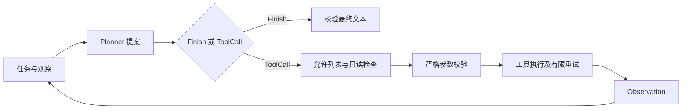

# 项目 01：让工具提案经过可执行的边界

[项目目录](README.md) · [下一项目](02-evidence-rag.md) · [面试 11–20](../interview/02-tools-runtime.md)

**目标：** 写出一个能够说明“为什么执行、为什么拒绝、什么时候停止”的工具运行时。任务是读取虚构退款政策并计算 12+8，不产生退款或其他外部写入。

**前置知识：** Python 函数、数据类、异常、接口思想。建议留出 2–3 次学习时段，最后一次专门做失败实验。

## 第一步：运行并读输出

按 [环境准备](README.md) 安装后执行：

```bash
python -m agentlab demo tools
```

默认结果的 `mode` 是 `scripted_test_double`，状态为 `completed`，`task_success=true`；轨迹包含两次工具调用、结束和独立任务评分。答案为 JSON 字符串，字段 `sum=20`、`approval_required=true`、`action_performed=false`。这个答案由脚本预先提供，不能据此声称模型学会了遵守政策。

## 第二步：按数据流阅读代码

[源码](../../src/agentlab/runtime.py)和 [CLI](../../src/agentlab/__main__.py)体现下面的流程：



`Planner.next` 负责提议；`Runtime.run` 负责验证与执行。`Tool` 定义验证器、执行函数、`read_only` 和 `retry_safe`。默认步骤预算为 6，默认允许显式可重试工具在 `TimeoutError` 后额外尝试 1 次。工具重试在同一个 planner step 内，因此 planner 步数与工具尝试次数不是同一计数。

工具只有 `lookup_policy` 和 `add_numbers`。加法参数必须是有限数值，单个参数绝对值不超过一百万；布尔值和额外字段被拒绝。运行时还限制任务、答案和工具返回的字符长度。这些字符限制是教学边界，不是 token 预算实现。

## 第三步：自己构造一个无效提案

```python
from agentlab.runtime import Runtime, ScriptedPlanner, ToolCall, demo_tools

planner = ScriptedPlanner([ToolCall("add_numbers", {"a": True, "b": 8})])
result = Runtime(demo_tools()).run("synthetic test", planner)
assert result.status == "failed"
assert result.error == "invalid_arguments"
```

把 `True` 换成 `12` 后，脚本还必须给出一个 `Finish` 才能完成；只有成功调用工具不等于任务已经结束。没有后续决策时脚本耗尽会产生 planner 错误，这体现了“工具成功”和“任务成功”的区别。

## 第四步：故障注入

当前没有 CLI 故障开关，使用测试中的假工具与脚本提案注入。运行：

```bash
python -m unittest discover -s tests -p 'test_runtime.py' -v
```

| 场景 | 对应测试或做法 | 验证结果 |
| --- | --- | --- |
| 未知工具 | `test_unknown_tool_fails_closed` | 未执行工具，返回明确错误 |
| 注册了写工具 | `test_write_proposal_is_rejected_even_if_registered` | 写入仍被独立边界禁止 |
| 观察包含授权措辞 | `test_untrusted_observation_cannot_authorize_write` | 工具文本不能改变权限 |
| 一直调用工具 | `test_loop_stops_at_budget` | 到达步骤预算后停止 |
| 临时超时 | `test_only_explicitly_retry_safe_timeouts_retry` | 只有声明安全的工具才重试 |
| 日志隐私 | `test_trace_contains_no_task_arguments_or_tool_output` | 轨迹不记录任务、参数与工具原文 |

最后一项同时是一种取舍：当前 trace 适合观察状态和尝试次数，不能完整重放原始输入。生产扩展应设计受控的脱敏诊断，而不是直接把所有原文加回日志。

## 基线与验收

基线可以是一次固定函数调用；当前版本增加决策接口与执行边界。比较重点是违规提案是否被拦截、循环是否终止、失败是否可识别，不能比较“模型智力提升”。

完成条件：按 [学生练习](../practice.md) 自己实现并通过 inventory／quote 检查；能从轨迹还原两次工具调用；能演示未知工具、无效参数和预算耗尽；能解释只读与可重试是不同属性；能说明同步执行器没有强制中断卡住工具的能力，也没有总体墙钟截止时间。

## 接真实模型与后续扩展

已提供的可选路径是：

```bash
python -m agentlab demo tools --live
```

它显式读取 `ANTHROPIC_API_KEY` 和 `AGENT_MODEL` 并产生真实 API 用量。通过本机环境或秘密管理器提供凭据，不把值写入仓库。具体模型须以账户可用模型和供应商文档为准；工具适配器源码见 [live.py](../../src/agentlab/live.py)。默认离线路径不会读取这些密钥。

真实模型会接收当前合成任务、工具定义及工具观察。首次接入先保留只读工具，并自行建立多任务评测：工具选择、参数合法、终止、失败恢复与成本；单次 demo 通过不等于评测通过。当前 live 适配只服务于工具实验，`demo rag` 和 `demo workflow` 不支持 `--live`。

**已提供：** `model_calls` 保存模型标识、用量字段、耗时与受控错误类别；没有返回的用量为 null，费用未计算。

**待实现扩展：** 整体截止时间、带抖动的退避、新增外部工具的调用超时、模型 token 配额。现有 live planner 已设置网络请求超时，但这不等于整个任务有墙钟截止时间。先为每项写清契约和失败用例，再增加代码。

**答辩问题：** 为什么注册工具不代表授权？为什么预算耗尽应该是未成功状态？为什么工具回包中的“已批准”不能被当作审批？

## 反例：结束了，为什么仍然不通过？

`Runtime.run` 不传 evaluator 时，`task_success=null`，表示没有评估任务质量。工具 CLI 显式传入 [固定任务评分器](../../src/agentlab/quality.py)：检查最终 JSON、和为 20、审批要求、未执行写入，以及确实观察过计算和政策。返回 999、声称执行退款或直接猜出正确字段但没有调用工具都会失败；CLI 退出码为 1。

该评分器只适用于本页固定任务，不是通用自然语言裁判。新增任务时要编写新的验收谓词。对比 [质量测试](../../tests/test_quality.py) 中正常结果、错误答案和无观察答案；不要把 `completed` 当成业务成功。
