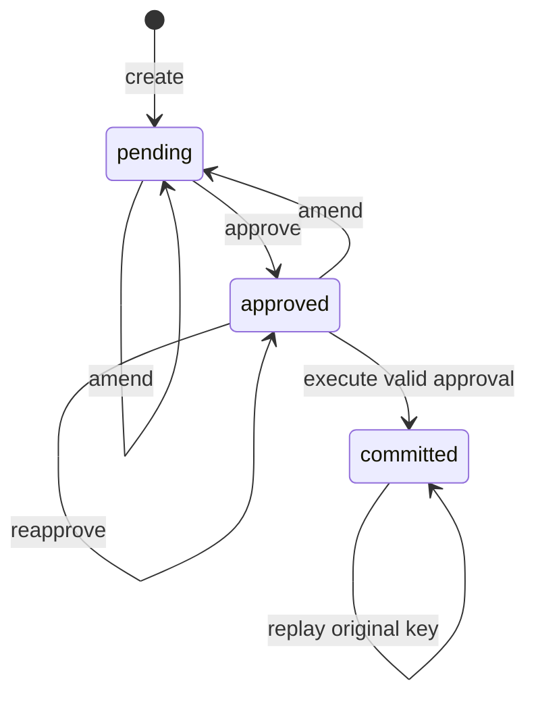

# 项目 03：审批、幂等与恢复

[项目目录](README.md) · [上一项目](02-evidence-rag.md) · [综合项目](capstone.md)

**目标：** 在一个虚构的本地工单系统中，证明未经审批不执行、批准的内容不能被悄悄替换、重复请求不重复创建工单，并在关闭数据库连接后继续执行。

本项目运行固定工作流。`approve` 的调用者是可信本地代码，当前没有 HTTP、用户登录或真实审核人身份校验；演示中的审核人标识不是认证系统。

## 第一步：运行演示

```bash
python -m agentlab demo workflow
```

预期观察：初始状态 `pending`；无令牌执行被拒绝；批准后关闭连接，再打开看到 `approved`；首次执行与重放返回相同结果；`ticket_count` 为 1；最终状态 `committed`。演示使用临时数据库，退出后会清理，不会留下一项真实工单。

## 第二步：画出状态与数据关系



[workflow.py](../../src/agentlab/workflow.py)中的 `requests` 存参数、摘要、版本与审批；`tickets` 存本地副作用；`operations` 存租户范围的幂等键和原结果。

`approve` 绑定当前 payload digest、version 与有效期；`amend` 增加版本并清除审批。`execute` 把创建 ticket、保存幂等结果、更新状态放在同一个 SQLite 写事务内。相同幂等键指向其他请求或参数时返回冲突；已提交请求不允许用新键再次执行。

一个细节：已提交结果的重放不会产生新副作用，因此即使原审批后来过期，也可返回原结果。HTTP 扩展仍必须先认证并检查结果读取权限，不能把“可重放”解释为“任何人可读”。

## 第三步：保留自己的练习数据库

在仓库根目录运行以下代码，数据只写入 `work/`：

```python
from pathlib import Path
from agentlab.workflow import TicketWorkflow

Path("work").mkdir(exist_ok=True)
database = Path("work/tutorial-workflow.sqlite3")
payload = {"subject": "Demo outage", "body": "Fictional service unavailable.", "priority": "P1"}

with TicketWorkflow(database) as workflow:
    workflow.create("campus", "practice-1", payload)
    token = workflow.approve("campus", "practice-1", reviewer="demo-reviewer")

with TicketWorkflow(database) as workflow:
    print(workflow.checkpoint("campus", "practice-1"))
    first = workflow.execute("campus", "practice-1", approval_token=token, idempotency_key="execute-1")
    replay = workflow.execute("campus", "practice-1", approval_token=token, idempotency_key="execute-1")
    assert first == replay
    assert workflow.ticket_count("campus") == 1
```

这段代码展示连接重启恢复，令牌仍在当前 Python 进程内存中；不宣称已完成进程崩溃后令牌交接。重复运行整段会遇到 `request_already_exists`，可改用新的练习数据库文件名。生产请求不能靠不断换幂等键绕过冲突。

## 第四步：把故障插入状态转移

```bash
python -m unittest discover -s tests -p 'test_workflow.py' -v
```

| 故障 | 对应测试 | 需要解释的行为 |
| --- | --- | --- |
| 文本写“已经批准” | `test_text_claims_cannot_approve` | 文本不是有效审批令牌 |
| 批准后修改正文 | `test_payload_change_invalidates_approval` | 旧摘要／版本不能批准新动作 |
| 审批过期 | `test_expired_approval_fails` | 首次提交被拒绝，需重新审批 |
| 响应丢失后重试 | `test_replay_returns_same_result_after_expiry` | 返回原结果，不再写入 |
| 两个调用同时重试 | `test_concurrent_retries_create_one_ticket` | 本地事务与唯一约束维持一张工单 |
| 副作用后记录失败 | `test_effect_and_dedup_record_roll_back_together` | 同一事务回滚，不留半成品 |

这里通过受控测试制造故障，CLI 没有故障开关。读测试时画出“检查→写 ticket→写 operations→更新状态→commit”的时间线，说明每一步失败时数据库应是什么状态。

## 基线与验收

不带幂等的基线是每次执行都插入一张工单。可以在独立的练习文件中模拟该行为，再与现有工作流对比同一请求的两次提交；不要修改正式实现来制造“基线提升”。

验收要求：未批准时工单数保持 0；改参数后旧审批失效；相同逻辑操作重放仅有一条副作用；同键异请求冲突；连接恢复后的状态一致；能够解释本地事务的保证范围。

## 从本地事务到真实服务

**尚未实现：** 真实登录与角色、远程审批页面、HTTP API、队列 worker、部署、多副本调度、外部工单系统和 outbox。

外部工单创建无法与本地 SQLite 事务自然形成同一个原子提交。建议扩展时把待执行动作与 outbox 同事务写入，由 worker 使用稳定的下游幂等键执行；必要时查询下游状态和对账。不能在数据库事务中简单包一个 HTTP 调用，就宣称两边恰好一次。

接入模型时只让它准备草稿和查询信息；`approve` 必须属于已认证的人类审批或明确的业务授权服务，不能注册成模型可调用工具。每次扩展都需要自己的权限、幂等、崩溃恢复和真实模型评测。

**答辩问题：** 为什么审批绑定版本？为什么同键重放和新键重执行不同？为什么示例没有证明真实用户身份，也没有证明外部 API 恰好一次？
