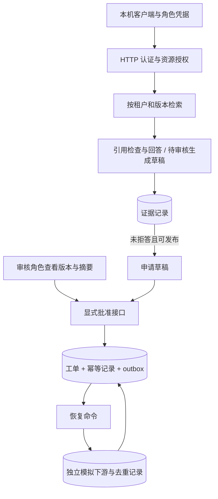

# 综合项目：交付一套可解释、可恢复的校园服务台

[项目目录](README.md) · [服务实现与操作](05-service.md) · [中文 RAG](04-chinese-rag.md) · [作品集清单](../templates/portfolio.md)

目标是完成一条能运行、能查错、能解释的应用链路：**身份 → 问题 → 证据 → 草稿 → 审核 → 提交 → 恢复**。场景和角色均为合成数据，不连接真实校务、退款、邮件或个人账户。

## 参考实现与个人成果分开

仓库提供可运行的本机 HTTP 参考服务、中文检索、持久化工作流和独立模拟下游。它用来学习和建立基线。学生还必须完成一个新工具、一次独立业务变化、一份评测报告和迁移答辩，才能通过应用作品集验收。

| 层次 | 当前实现 | 边界 |
| --- | --- | --- |
| 资料与回答 | 中文词项／BM25、资料版本和租户过滤、引用检查、拒答 | 词项检索不是通用语义理解；生成主张的语义支持不能只靠字符串验证 |
| 模型 | 可选本地 Ollama；原工具实验保留可选 Claude 适配 | 默认不调用；HTTP stub 通过不等于真实模型验证；用实际运行填写报告 |
| 身份与角色 | 本地随机 bearer 凭据，服务端派生租户、主体和角色，配置撤权 | 不包含 SSO、真实身份核验、互联网登录或成熟密钥管理 |
| 审核与工单 | 查看草稿、版本／摘要批准、有效期、状态、幂等 | 单机教学角色；审核动作来自明确接口，模型没有批准权限 |
| 恢复 | 工单与 outbox 同事务，独立 SQLite 下游去重，可注入效果后崩溃 | 至少一次投递加幂等消费者，不是任意外部服务的 exactly-once |
| 运行 | 本机启动、健康检查、受控事件与指标、写入开关、备份与恢复操作 | 标准库单进程服务，仅回环地址；不作为公网生产服务部署 |

真实模型质量和真人学习效果没有预填结果。当前的范围说明与可重复证据见 [验证范围](../verification.md)。

## 先画出信任边界



用户输入、检索文档、模型输出都不能决定身份或授予权限。客户端不给 `tenant`、`actor` 或审批令牌；服务根据已认证主体确定访问范围。审核人必须批准自己实际看到的版本。数据库事务内再次比较版本，防止“看了 A，执行 B”。

生成结果的引用结构通过但语义仍待核验时，只保存为查询中的 `generated_draft`；当前申请接口返回 `422 evidence_required`，不能把待审核文本自动送进工单。人工语义审核与工单动作批准是两项不同检查。

本项目采用固定流程承载知识与审批应用；需要动态规划时，先说明固定流程解决不了哪一类任务，再引入工具 Planner。多 Agent 和自动写入不是结课要求。

## 按产物完成，不按读完页数完成

| 阶段 | 学生工作 | 可核查产物 |
| --- | --- | --- |
| G0 先修 | 完成 [诊断与补课](../prerequisites.md) | 自己的提交通过基础检查；能解释 JSON、HTTP 和事务 |
| G1 工具 | 完成 [渐进练习](../practice.md)，独立写后续变体 | 学生文件、测试报告、一个原实现失败的反例 |
| G2 资料 | 跑中文基线；先固定切分，再更改一个检索策略 | 数据／配置摘要、逐题对照、覆盖与错误切片；不能只展示综合分数 |
| G3 应用 | 启动服务，分别扮演申请人与审核人；走一次拒绝与正常流程 | 状态查询、身份／版本测试、可复现启动路径 |
| G4 恢复 | 重启进程；制造下游已写入而回执未保存 | 故障前后状态、同键重试记录、下游仅一条效果的证据 |
| G5 独立变化 | 完成一个未直接提供完整解答的业务变化 | 新接口／状态契约、改动、能在旧版本失败的测试与答辩 |
| G6 模型实验 | 实際接入本地模型或明确配置的 API，限制资料和预算 | 模型／数据版本、真实逐题输出、用量／延迟、人工主张审核与失败分析 |
| G7 交付 | 另一位同学按 README 复现，完成 CS 与项目答辩 | [交付清单](../templates/portfolio.md)、复现卡点、帮助程度和未验证项 |

**基础结课**可以止于 G1；**离线应用工程作品**要求 G0–G5；**大模型应用作品集**还需要 G6–G7。没有模型环境时继续做离线部分，把 G6 标为待完成，不能用 mock 结果补齐。完成这些训练也不是录用保证，继续按 [目标岗位](../job-readiness.md) 补通用基础。

## 第一次完整操作

先按 [项目 05](05-service.md) 运行服务及客户端。理解每一步后再运行自动 smoke：

```bash
python scripts/smoke_service.py
```

这个命令使用真实本机 HTTP、临时凭据和临时数据库，自动模拟审核人并制造下游故障。`human_learning_verified=false` 表示它没有真人学习或审核证据；自动通过不算你独立完成 G5 或 G7。

再运行中文评测：

```bash
python -m agentlab.rag_eval --output work/zh-evaluation.json
```

先读报告里的每条失败，再改参数。测试题公开可见，不能把反复查看后调参称为未见测试泛化；独立迁移应换文档族和约束，由观察者保留新题答案。

## 独立变化怎样选

任选一个与现有功能不同的需求，先写行为契约再实现：给尚未批准的申请增加撤回；给只读工具增加新参数和权限限制；为文档撤权设计缓存失效；为下游暂时不可用增加有总预算的调度。难度按起点选择，不要求初学者一次完成全部。

可以使用 [独立迁移任务](../teaching/learner-task.md)，让同伴在第二轮改变一项约束。借助资料或工具并不妨碍学习，但在交付清单中如实注明帮助；独立能力的验收需要相应的无代写尝试。

## 失败比成功截图更有信息

至少解释以下四条时间线：

1. 申请人试图替审核人批准，服务拒绝，工单数不变。
2. 审核人查看后草稿被修改，旧版本的批准失败，需要重新查看。
3. 提交响应丢失，原键重放返回原结果；换键不会产生第二张工单。
4. 下游写入成功后进程崩溃，outbox 仍待投递；恢复按稳定事件 ID 去重。

把测试、数据库约束和实际观察连起来。单次没有失败不证明不存在竞态；本地两个数据库的实验也不能自动推广到没有幂等支持的外部服务。

## 交付前复核

运行测试与文档／公开内容检查；确保没有凭据、数据库、个人作业、私有路径或真实业务资料。记录本机部署边界、数据备份和恢复步骤，讨论未来改用成熟 Web 服务框架、TLS、限流、监控、身份系统和多 worker 时必须重验的条件，不把设计写成已上线。

[小规模真人试学](../teaching/pilot.md) 是课程维护者的额外验收，不与软件测试混用。没有实际参加者时保持待验证状态。
