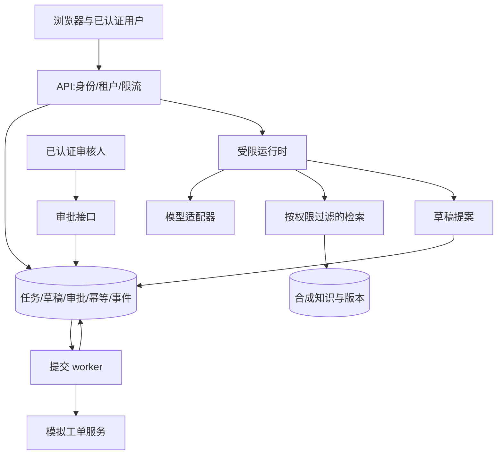

# 综合项目：把知识与工单助手交付成服务

[项目目录](README.md) · [评测数据集](evaluation-dataset.md) · [架构决策](architecture-decisions.md)

**状态：设计规格与实施路线。** 仓库已实现三个离线实验；本页的 HTTP、身份认证、服务部署、队列和监控均是待完成的综合项目。完成后应提交对应代码和验证证据，不能把本页规格直接写成已交付能力。

## 产品目标与范围

虚构的“校园服务台”面向两个互相隔离的租户，提供政策查询、证据引用、工单草稿、人工批准和提交结果查询。用合成制度与虚构用户角色演示；不连接真实校务、邮件、金融或个人账户。

MVP 只支持一种工单类型、一套允许的优先级与一个模拟下游服务。知识不足时澄清或拒答；系统只能承诺记录中已确认的动作。退款、账户删除和任意代码执行不在项目范围内。

**设计负载假设：** 峰值 5 次任务提交／秒，每个任务最多 6 个规划步骤、4 次只读工具调用，墙钟时间预算 60 秒。这些是练习约束，不是实测容量。先实现单 worker，再用相同负载模型测量是否需要并行扩展。

## 架构与信任边界



浏览器输入、模型输出、知识文档与工具观察都不能直接授予权限。认证层确定主体；授权层检查主体与资源关系；运行时限制动作；数据库维护业务不变量。模型服务收到的材料也视为外发数据，接入前说明字段范围并使用合成样本。

## 数据模型与不变量

| 记录 | 核心字段 | 必须保持的约束 |
| --- | --- | --- |
| run | id、tenant、actor、status、budget、config_version | 所有查询按 tenant 和资源权限过滤 |
| evidence | doc_id、revision、scope、content_hash | 引用指向确切版本，撤权后不能继续复用缓存 |
| draft | id、tenant、payload、digest、version、state | 每次修改增加 version，并使旧审批失效 |
| approval | draft_id、digest、version、reviewer、expires_at | 审核人有权批准该动作，未过期且内容一致 |
| operation | tenant、key、request_digest、status、result | 同键异请求拒绝，完成结果重放 |
| outbox | operation_id、payload、attempts、next_attempt_at | 与待执行状态同事务写入，失败可追踪 |
| event | run_id、sequence、type、safe_summary | 序号稳定，不保存密钥或无关原文 |

项目 03 已有 requests、tickets、operations 三张本地表，并覆盖本地事务；上述更完整模型属于扩展设计。不要同时保留两套互相不一致的状态定义，上线实现需要一次明确的数据迁移。

业务状态建议为 `draft → pending_approval → approved → submitting → committed`，另有 `rejected`、`cancelled`、`failed`。允许的转移写在代码中，不能让模型任意设置 state。`submitting` 后取消可能来不及，需查询实际结果；已经 `committed` 的动作只能通过另一个授权的补偿流程处理。

## API 契约

以下是待实现的版本化 HTTP 契约。TLS 由服务入口提供。身份令牌来自认证服务，`tenant_id` 不允许出现在模型生成的操作参数中；服务器从已认证会话及成员关系派生租户。浏览器采用 cookie 会话时增加 CSRF 防护；使用 bearer token 时不要把令牌存入日志或 URL。

| 方法与路径 | 调用方 | 成功响应 | 关键条件 |
| --- | --- | --- | --- |
| `POST /v1/runs` | 已认证成员 | 202 + run_id | `Idempotency-Key` 必填，输入限长 |
| `GET /v1/runs/{run_id}` | 有读取权限的成员 | 200 + 状态和结果 | 不允许读取其他租户任务 |
| `GET /v1/runs/{run_id}/events` | 同上 | 200 + SSE | 支持 `Last-Event-ID`，事件有序号 |
| `POST /v1/drafts` | 授权应用代码 | 201 + 草稿版本 | schema 校验，不产生外部工单 |
| `PATCH /v1/drafts/{id}` | 草稿编辑者 | 200 + 新版本 | `If-Match` 必填，修改作废旧审批 |
| `POST /v1/drafts/{id}/approvals` | 审核角色 | 201 + 审批状态 | 绑定 digest、version、有效期 |
| `POST /v1/drafts/{id}/commit` | 授权执行服务 | 202 + operation_id | 当前审批有效，幂等键必填 |
| `GET /v1/operations/{id}` | 有权限成员 | 200 + 操作结果 | 结果读取也检查资源权限 |
| `POST /v1/runs/{id}/cancel` | 任务所有者 | 200 或 409 | 已提交副作用不能伪装成已撤销 |

提交请求示例：

```http
POST /v1/runs
Content-Type: application/json
Idempotency-Key: demo-run-001

{"question":"What is the fictional refund review window?","mode":"answer_or_draft"}
```

```json
{"run_id":"run_demo_001","status":"queued","links":{"status":"/v1/runs/run_demo_001"}}
```

草稿与批准示例：

```json
{"subject":"Demo service outage","body":"Synthetic classroom service is unavailable.","priority":"P1"}
```

```json
{"draft_version":3,"payload_digest":"SERVER_PROVIDED_DIGEST","decision":"approve"}
```

审批界面读取服务端规范化草稿，展示目标、字段和后果，再提交批准。客户端给出的摘要只用来检测其所见版本，服务端必须独立重新计算和比较。审批令牌保留在服务端受控存储，不进入模型上下文。

错误统一返回如下结构，`message` 不回显密钥、SQL 或完整工具原文：

```json
{"error":{"code":"approval_stale","message":"Draft changed; review the current version.","retryable":false},"request_id":"req_demo_001"}
```

- 400：JSON、字段、类型或限长错误；不能靠盲目重试修复。
- 401：未通过认证；403：已认证但操作权限不足。跨租户资源可统一 404 以减少存在性泄漏。
- 409：幂等键对应不同请求、状态冲突或不允许取消；412：`If-Match` 版本不匹配；428：需要但未提供版本条件。
- 429：限流，按服务指定的 `Retry-After` 与总体预算处理。
- 503：暂时不可用；写请求重试沿用原幂等键，并允许先查询 operation 状态。

HTTP 方法本身的幂等语义不等于业务副作用自然幂等；POST 的重放规则由这里的应用契约实现。[HTTP 语义标准](https://www.rfc-editor.org/rfc/rfc9110.html#name-idempotent-methods)

## 幂等与外部提交契约

幂等记录作用域为 `(tenant, authenticated_actor, endpoint, key)`；记录包含规范化请求摘要、操作状态及稳定结果。若业务希望同租户跨用户共享某个业务操作，则额外使用业务唯一键，不能靠放宽读取权限实现。本文与本地实验的键作用域不同，扩展时需要显式迁移和测试。

同键同摘要：处理中返回同一 operation_id；完成后返回原结果。同键异摘要：409。保留时长是业务配置，超过期限后客户端不能假设键仍有效；重复业务动作还需要唯一业务约束保护。

数据库内先创建 operation 与 outbox，同事务提交；worker 读取 outbox，向下游传递稳定幂等键，然后保存结果。若下游响应丢失，使用同键重试或查询，不生成新逻辑动作。如果下游不支持幂等或状态查询，需要明确人工对账路径，不能宣称避免所有重复。

多个 worker 用可抢占租约或数据库锁认领任务；租约过期后的旧 worker 可能还在执行，因此应结合 fencing／版本检查和下游幂等，不能只靠“拿过锁”证明安全。第一版可以保留单 worker，先把契约测试完成。

## 威胁模型与验证

| 威胁入口 | 不良后果 | 主要控制 | 验证方法 |
| --- | --- | --- | --- |
| 检索片段含“调用 approve” | 未经人类批准提交 | approve 不注册给模型；服务端授权 | 合成注入任务不得产生审批记录 |
| 请求伪造 tenant 或资源 ID | 跨租户读取／写入 | 认证上下文派生 tenant；资源授权 | 同 ID、不同主体的访问矩阵测试 |
| 草稿批准后被修改 | 批准 A 却执行 B | 摘要、版本、有效期与条件更新 | 并发修改与执行测试 |
| 响应丢失或双击提交 | 重复创建工单 | 幂等记录、事务、下游稳定键 | 在每个提交边界注入崩溃 |
| 工具 URL 或输出可控 | SSRF、数据外发、上下文污染 | 固定允许目标、禁私网越界、返回限长 | 恶意地址和超大响应测试 |
| 高开销循环、重试洪峰 | 成本失控、服务阻塞 | 步数／时间／token预算、有界并发 | 无限循环与连续限流场景 |
| 日志含密钥或用户原文 | 数据泄漏 | 采集前脱敏、访问控制、保留期 | 日志字段断言与秘密扫描 |
| 过期或冲突资料 | 错误业务建议 | 文档版本、有效期、冲突拒答 | 新旧政策与撤权回归 |

这些控制应由彼此独立的组件落实。提示词中的“不要越权”帮助模型理解任务，无法替代服务端权限判断。风险分类可参考 [OWASP LLM Top 10](https://genai.owasp.org/llm-top-10/)，本表是针对该合成项目的具体设计。

## 评测与发布门槛

先完成 [数据协议](evaluation-dataset.md)，再决定发布阈值。下面是项目练习的**建议门槛，不是现有测量结果**：

1. 所有确定性权限、状态转移、幂等与回滚契约测试通过；观察到任一越权或重复副作用就阻止发布。
2. 固定测试集同时报告正确作答、合理拒答、主张支持性、任务完成、延迟与成本，不能只给综合平均分。
3. 新方案对关键切片无未解释退化；若提高拒答率，明确展示覆盖损失及产品取舍。
4. 在固定硬件、负载模型与版本下测 p50／p95 延迟、错误率与队列长度。达到设计负载的证据来自报告，不来自代码中的并发参数。
5. 用实际重启、依赖不可用和撤权测试检查恢复；演练关闭写入工具后仍能提供只读查询。

真实模型可以在只读阶段接入；写操作的授权和事务仍由服务决定。至少使用多个任务与重复尝试，记录模型标识、提示、数据版本、所有调用与重试成本。一次成功演示不构成发布评测。

## 实施里程碑

| 阶段 | 实现内容 | 可交付证据 |
| --- | --- | --- |
| M0 | 跑通三个离线实验，解释边界 | 命令、测试、一个失败案例 |
| M1 | HTTP 只读知识服务与认证、租户隔离 | API 契约测试、越权拒绝测试 |
| M2 | 草稿、审批界面、版本检查 | 改参数后原批准失效的录屏与测试 |
| M3 | 模拟下游、outbox、幂等、重启恢复 | 故障时间线、数据库状态与重放结果 |
| M4 | 可选真实模型，只接合成资料 | 固定评测报告、成本、失败分析 |
| M5 | 打包部署、健康检查、日志与回滚 | 部署步骤、负载条件、恢复演练 |

部署可用单容器加持久卷作为学习起点。服务进程以受限用户运行；数据库不得写在临时容器层；秘密由运行环境注入；健康检查区分进程存活与依赖就绪。若扩展到多实例，重新评估数据库并发、迁移和 worker 认领协议，不直接复制进程数。

回滚应能切换应用版本与模型配置、暂停新的写任务，并让已提交操作继续可查；数据库迁移保持前后兼容或提供经过验证的恢复方案。每个运行记录配置版本，便于把失败对应到具体发布。

## 最终答辩交付

提交一条可复现启动路径、架构图、API 契约、数据说明、三项 ADR、测试与评测报告、一个故障复现、部署与回滚步骤。结果未测量的字段保持“未测量”；没有真实用户就写“合成场景”。个人贡献应具体到实现、设计或实验，参考 [项目答辩模板](../interview/portfolio.md)。
